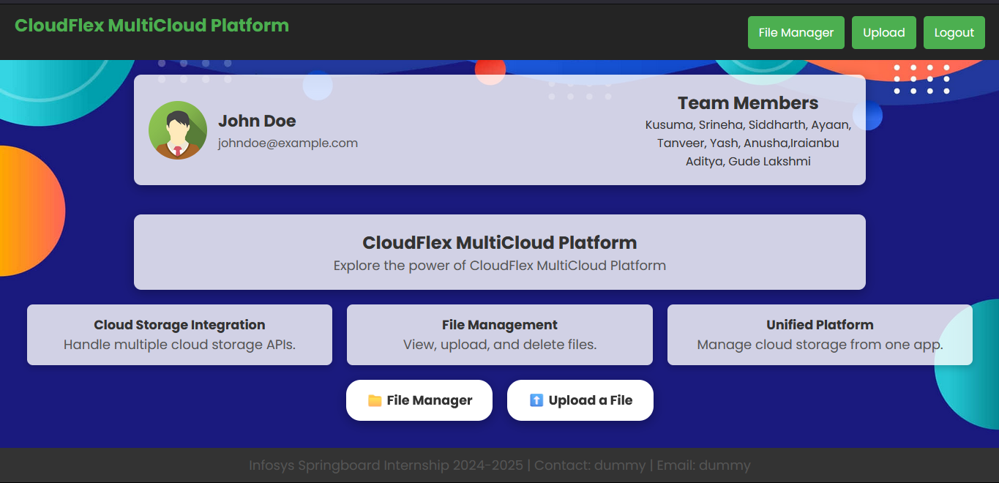
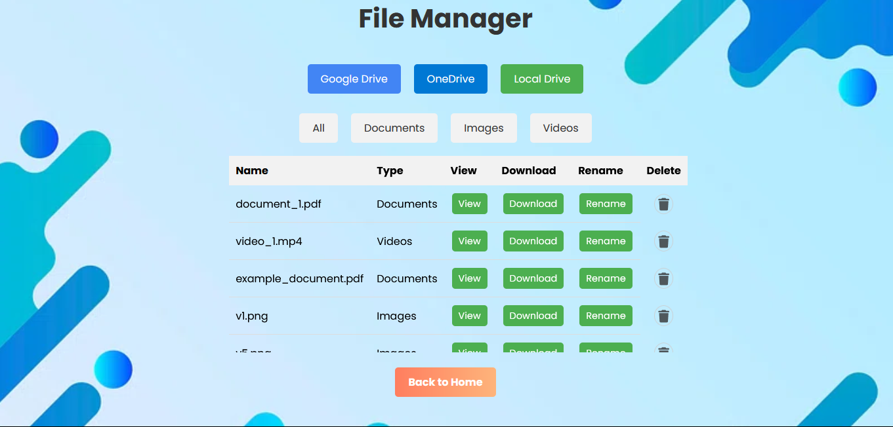
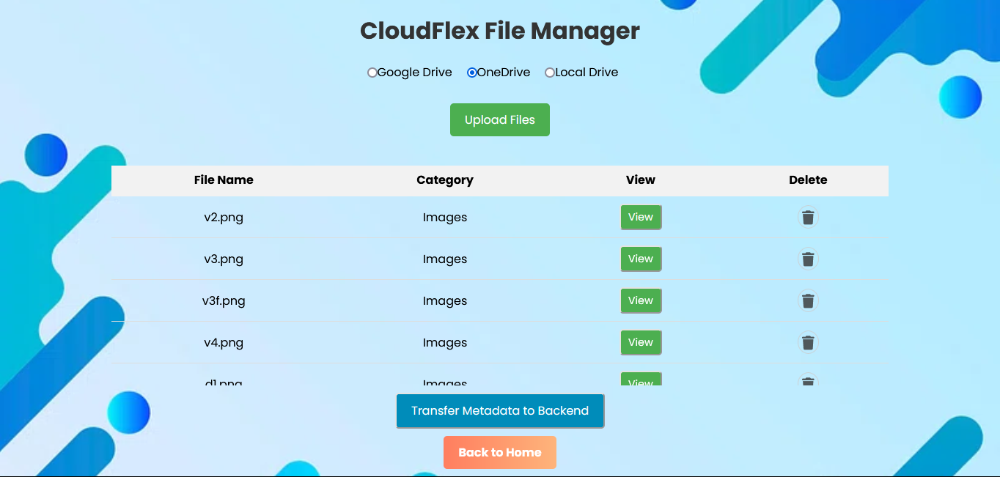

# 🌥️ Siddharth's Cloud Storage Manager

## Overview
**Siddharth's Cloud Storage Manager** is a web application that allows users to connect and manage multiple cloud storage platforms from a single interface. It provides seamless integration with various cloud services, enabling efficient file storage, retrieval, and synchronization.

## 🚀 Features
- Connect multiple cloud storage services in one place.
- Secure authentication and access management.
- File upload, download, and synchronization.
- User-friendly dashboard for managing storage.
- Supports real-time data updates.

## 🛠️ Tech Stack
- **Frontend:** React.js  
- **Backend:** Spring Boot  
- **Database:** MySQL  
- **Architecture:** MVC2  

## 📌 Installation

### **1. Clone the Repository**
```sh
git clone https://github.com/yourusername/multicloud-storage-manager.git
cd multicloud-storage-manager
```

### **2. Backend Setup (Spring Boot)**
```sh
cd backend
mvn clean install
mvn spring-boot:run
```

### **3. Frontend Setup (React.js)**
```sh
cd frontend
npm install
npm start
```

### **4. Database Setup**
- Install MySQL and create a database:
  ```sql
  CREATE DATABASE multicloud_storage;
  ```
- Configure `application.properties` in the Spring Boot project.

## 📖 Project Structure
```
multicloud-storage-manager/
│── backend/          # Spring Boot backend
│── frontend/         # React.js frontend
│── database/         # SQL scripts
│── README.md         # Project documentation
│── images/           # Screenshots
```

## 📷 Screenshots





## 💡 Future Enhancements
- Support for additional cloud storage providers.
- Advanced file search and organization.
- AI-powered storage optimization.

## 🤝 Contributing
Feel free to fork this repository and submit pull requests.

## 📜 License
This project is licensed under the MIT License.

---

🔗 **Connect with us:** [GitHub](https://github.com/yourusername/multicloud-storage-manager)

